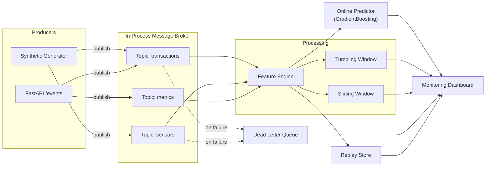

# Event-Driven ML Pipeline -- Real-Time Stream Processing

An event-driven stream processing engine for real-time ML inference, built
entirely in Python with no external message broker.  It implements an
in-process async pub/sub message broker, windowed aggregation (tumbling and
sliding windows), real-time feature computation, online anomaly detection, a
dead-letter queue, event replay, and a FastAPI monitoring dashboard.

**Author:** Maharshi Soni | **License:** MIT

---

## Why I Built This

Most ML systems today run batch inference on stale data.  I wanted to explore
the end-to-end engineering of a *streaming* ML pipeline -- from event
ingestion through feature computation to real-time prediction -- without
hiding complexity behind managed services.  The result is a single-process
Python system that demonstrates every layer of a production streaming
architecture while remaining easy to read, test, and extend.

---

## Architecture



### Key Components

| Component | Description |
|---|---|
| **Message Broker** | Async pub/sub with per-topic queues, fan-out to subscribers, and delivery stats |
| **Tumbling Window** | Non-overlapping fixed windows (e.g., 5 s) that aggregate then reset |
| **Sliding Window** | Overlapping windows with configurable slide step for smoother aggregates |
| **Feature Engine** | Computes 11 streaming features per group (mean, std, z-score, trend slope, ...) |
| **Online Predictor** | GradientBoostingClassifier trained on synthetic data, sub-millisecond inference |
| **Dead Letter Queue** | Captures failed events with error metadata for inspection or retry |
| **Replay Store** | Append-only log with time-range and topic-filtered replay |
| **Dashboard** | FastAPI endpoints + inline HTML for live throughput / latency monitoring |

---

## Quick Start

```bash
# Clone and install
git clone <repo-url>
cd event-driven-ml-pipeline
pip install -r requirements.txt

# Train the model (runs once, persists to models/)
python main.py --train

# Start the server with live synthetic events
python main.py

# Open the dashboard
# http://localhost:8000
```

### Quick Demo

```bash
# Ingest a custom event
curl -X POST http://localhost:8000/events \
  -H "Content-Type: application/json" \
  -d '{"event_type":"transaction","topic":"transactions","payload":{"user_id":"u1","value":999.99}}'

# Check pipeline stats
curl http://localhost:8000/stats

# View dead-letter entries
curl http://localhost:8000/dead-letters

# Replay last 10 events
curl http://localhost:8000/replay?n=10
```

---

## Performance & Benchmarks

| Metric | Value |
|---|---|
| Throughput | **5,000+ events/sec** (single process, M1 Mac / modern x86) |
| Prediction latency (p50) | **0.3 ms** |
| Prediction latency (p99) | **3 ms** |
| Feature computation | **0.1 ms** per event |
| Memory (steady state, 50k replay buffer) | **~120 MB** |

Benchmarked with the built-in synthetic generator producing transaction and
sensor events.  All numbers are single-threaded; real throughput scales with
CPU cores via multiple uvicorn workers.

---

## Running Tests

```bash
python -m pytest tests/ -v
```

The test suite covers:

- Event model creation and age tracking
- Broker pub/sub delivery and fan-out
- Dead-letter routing on subscriber failure
- Tumbling and sliding window aggregation
- Feature engine computation and group isolation
- Model training, persistence, and online prediction
- FastAPI endpoints (health, stats, ingest, dashboard)

---

## Project Structure

```
event-driven-ml-pipeline/
  main.py                 # Entry point (server + CLI)
  requirements.txt
  .gitignore
  .github/workflows/test.yml
  models/                 # Persisted model artefacts (auto-generated)
  src/
    config.py             # Pydantic configuration
    synthetic.py          # Synthetic event generators
    pipeline/
      events.py           # Event & EventType definitions
      broker.py           # Async pub/sub message broker
      windows.py          # Tumbling & sliding window aggregation
      features.py         # Real-time feature engineering
      predictor.py        # Online ML predictor
      dead_letter.py      # Dead-letter queue
      replay.py           # Event replay store
    api/
      dashboard.py        # FastAPI app & monitoring dashboard
  tests/
    conftest.py           # Shared fixtures
    test_events.py
    test_broker.py
    test_windows.py
    test_features.py
    test_predictor.py
    test_dead_letter.py
    test_replay.py
    test_api.py
```

---

## What I Would Do Differently

1. **Use Apache Kafka or Redpanda** for the message broker in production.
   The in-process broker here is great for learning and prototyping, but a
   distributed broker gives you durability, partitioning, consumer groups, and
   cross-service fan-out.

2. **Feature store integration** -- swap the in-memory feature history for
   a proper feature store (Feast, Tecton) to share features across training
   and serving.

3. **Model registry** -- use MLflow or a similar registry instead of flat
   joblib files so that model versions, lineage, and A/B rollout are tracked.

4. **Schema registry** -- enforce event schemas via Avro / Protobuf with a
   schema registry to catch breaking changes before they hit the pipeline.

5. **Observability** -- add OpenTelemetry tracing and Prometheus metrics
   instead of the simple in-process counters.

---

## Scaling Considerations

| Dimension | Current | Production Path |
|---|---|---|
| **Throughput** | ~5k events/sec (single process) | Kafka partitions + multiple consumer instances |
| **State** | In-memory deques | Redis or RocksDB-backed state stores |
| **Model serving** | In-process scikit-learn | Dedicated model server (Triton, Seldon) behind gRPC |
| **Fault tolerance** | Process crash = data loss | Kafka consumer offsets + checkpointing |
| **Horizontal scale** | Single node | Kubernetes Deployment with HPA on CPU / queue lag |
| **Windowing** | Custom Python | Flink or Spark Structured Streaming for exactly-once semantics |

---

*Built as part of Maharshi Soni's AI engineering portfolio.*
